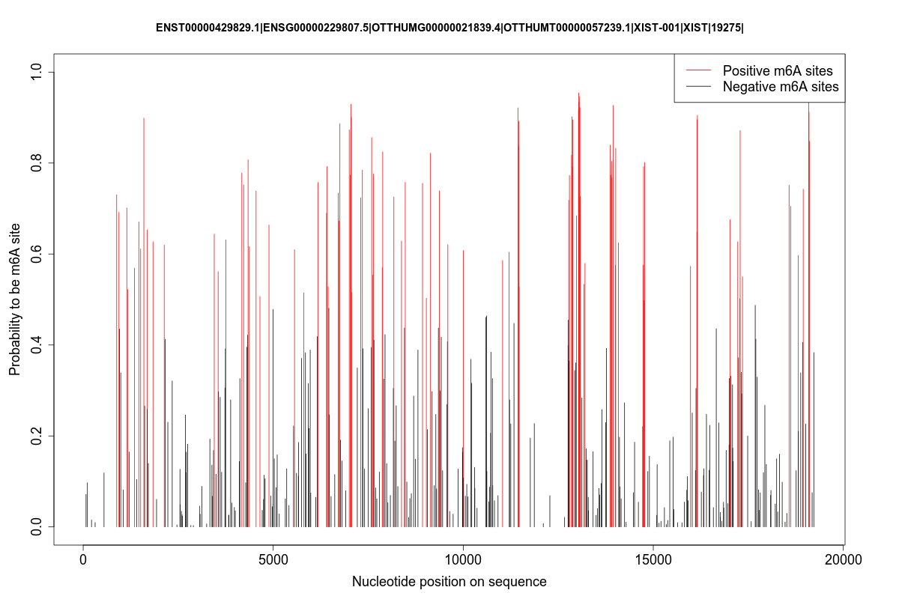

# TDm6A
In this study, by applying convolutional neural network (CNN) and long short term memory (LSTM), we have developed TDm6A, a deep learning model for predicting RNA m6A modifications in human cells.   

This documentation is part of the supplementary information release for TDm6A. For details of this work, users can refer to our paper "**Deep analysis of RNA N6-adenosine methylation (m6A) patterns in human cells**" (J. Wang  and L. Wang, 2019). 

# Requirements 
TDm6A is an R package with one necessary function written in Python. To use TDm6A, R version >= 3.4 is required. Versions for other packages are suggested. 

- R >= 3.4 (64-bit)

- Python 2.7 (64-bit)

- Keras 2.2.4 in R and Python

- seqinr (any applicable version) in R

- ROCR 1.0-7 in R

- reticulate 1.11.1 in R

- numpy in Python

**NOTE:** before using TDm6A, users should verify that the [Keras](https://keras.rstudio.com) package can be used in R by:
```
library("keras")
model <- keras_model_sequential() # Testing keras, no error for this step!!!!
```

# Installing TDm6A 
``` 
# Install and load TDm6A: 

devtools::install_github("BioDataLearning/TDm6A") 
library("TDm6A") 
``` 

# Getting the training and test data 
The training and test data of the three cell types (A549, CD8T and HEK293) have been packaged into TDm6A. x_train and x_test data are stored as matrices of dimension [instance_number, 1001, 4], with 4 representing channels of A, C, G and U; y_train and y_test data are stored as arrays of dimension [instance_number, 2], with 2 representing labels of the negative and the positive. All training sets have a 1:1 positive-to-negative ratio of instances, all test sets have a 1:10 positive-to-negative ratio of instances.

``` 
# Load datasets in lazy loading mode, here, use cell type HEK293 as an example:

data("x_train_HEK293") # dataset is lazy loaded as variable “x_train_HEK293” until being used
data("y_train_HEK293")
data("x_test_HEK293")  
data("y_test_HEK293") 


# Check datasets:

dim(x_train_HEK293) 
dim(y_train_HEK293) 
dim(x_test_HEK293) 
dim(y_test_HEK293)


``` 


# Testing TDm6A with test sets 
**Step 1**, loading required packages: 

``` 
library(keras) 
library(ROCR) 
library(seqinr)
``` 
**Step 2**, loading test sets in 3D matrices: 

```  
data(x_test_HEK293)
data(y_test_HEK293) 
``` 
**Step 3**, applying TDm6A on the test sets: 

The TDm6A models for all three cell types have been packaged into TDm6A named "**TDm6A_cellType_N.hdf5**", cellType = A549/CD8T/HEK293, N=[1,10]. The performance of TDm6A is the averaged value from ten models trained using the datasets have the same positive instances and different negative instances. To perform prediction on the test sets, use function **TDm6A_test()** which takes arguments the x_test, y_test, and cellType(="A549" or "CD8T" or "HEK293"): 

``` 
TDm6A_test(x_test_HEK293, y_test_HEK293, "HEK293") # don't forget the "" for cellType argument 

# The accuracy, sensitivity, specificity, MCC, ROC curve and ROC AUC value will be printed. 
``` 

# Motif visualization 
The strategy for motif visualization was written in python script, named "**getMotifs.py**". "getMotifs.py" defines a function **TDm6A_getMotifs()** which takes input x_train, y_train, x_test, y_test and cellType, and outputs a "**cellType_TDm6A_Position_Probability_Matrix.txt**" file containing the position frequency matrix for each kernel, which can be directly uploaded to [TOMTOM](http://meme-suite.org/tools/tomtom) for motif comparision and visualization. 

Here, we applied R package "reticulate" to run this python script packaged into TDm6A. 

**Step 1**, loading package and "getMotifs.py": 

``` 
library(reticulate) 
path <- system.file("getMotifs.py", package = "TDm6A")
source_python(path) 
``` 
**Step 2**, applying TDm6A_getMotifs(): 

Motif visualization needs the weights of the first layer of TDm6A which is not stored in a saved model. So, TDm6A_getMotifs() will train TDm6A and then visualize the kernels in the first CNN layer, here, use cell type HEK293 as an example:

``` 
# Load datasets if not loaded: 

data(x_train_HEK293) 
data(y_train_HEK293) 
data(x_test_HEK293) 
data(y_test_HEK293) 
```

```
# Get position probability matrix for each kernel: 

TDm6A_getMotifs(x_train_HEK293, y_train_HEK293, x_test_HEK293, y_test_HEK293,"HEK293") 

# This step may take tens of minutes since training epochs = 60
# When finished, the "HEK293_Position_Probability_Matrix.txt" file will be saved in **your current working directory** 
``` 

# Apply TDm6A to predict m6A sites on a given transcript 
For the easy and convinient application of TDm6A models, the function **TDm6A_application(faFile_Input,plot_Output,csvFile_Output, cellType)** is available for users to predict m6A sites on a given transcript. Users only need to prepare the individual fasta files for each transcript of interest. As a result, the fucntion will output a .png file and .csv file to the specified file paths.

**Usage:** here, we use XIST transcript as an example:

**Step 1**, loading required packages: 

``` 
library(TDm6A)
library(keras) 
library(ROCR) 
library(seqinr)
``` 
**Step 2**, setting the file path for input and output files, selecting specific models to use: 

```  
faFile_Input = "Desktop/XIST.fa"                      # file path for the input fasta file, change to your own settings
plot_Output = "Desktop/XIST_predicted_m6A.png"        # file path for the output plot, change to your own settings   
csvFile_Output = "Desktop/XIST_predicted_result.csv"  # file path for the output result, change to your own settings

cellType = "A549"         # which model to use, provided options are: "A549"/"CD8T"/"HEK293"/"panCell_mRNA"/"panCell_preRNA".
                          # If no preferred cell type, users can use the pan-cell model with transcript in mRNA or preRNA mode.
``` 
**Step 3**, applying models for prediction: 

```
TDm6A_application(faFile_Input, plot_Output,csvFile_Output, cellType)
```

To indicate the progress of the prediction, you will see the following running logs:
```
[1] "Running step 1: Finding all adenosine sites conforming to the DRACH motif...\n"
[1] "Running step 2: Input feature preparation...\n"
[1] "1001nt sequences checked.\n"
[1] "one-hot-encoding checked.\n"
[1]    4 1001  360
[1] "Input data checked.\n"
[1]  360 1001    4
[1] "TDm6A predicting...\n"
[1] "TDm6A prediction finished.\n"
[1] "Plotting...\n"
[1] "\nDone\n"
```

**Step 4**, checking the prediction results. Two output files have been stored to the specified file path, for example:

**Output file 1**, stored as "Desktop/XIST_predicted_m6A.png":




**Output file 2**, stored as "Desktop/XIST_predicted_result.csv" (only the first 10 rows are shown here):

A_site | Pred_Neg_Prob | Pred_Posi_Prob | predict_class
------ | ------------- | -------------- | -------------
75|0.928563195466995|0.0713551462|N
111|0.9029467225|0.0971666962|N
219|0.9846518576|0.0153094709|N
314|0.990193969|0.00978688|N
548|0.881451565|0.1186588973|N
881|0.2695866555|0.7304918885|P
941|0.3081773013|0.6917426944|P
953|0.5651386619|0.4351187766|N
988|0.6616799831|0.3384975821|N

**A_site**: the position of candidate adenosine in the given nucleotide sequence;

**Pred_Neg_Prob**: the predicted probability of this adenosine to be non-m6A site;

**Pred_Posi_Prob**: the predicted probability of this adenosine to be m6A site;

**predict_class**: this adenosine site is predicted to be a "P" (positive) or "N" (negative) m6A site.


